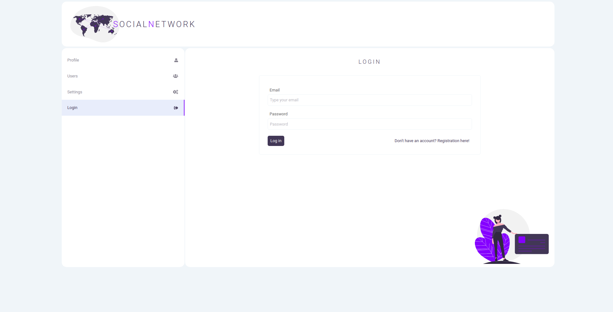
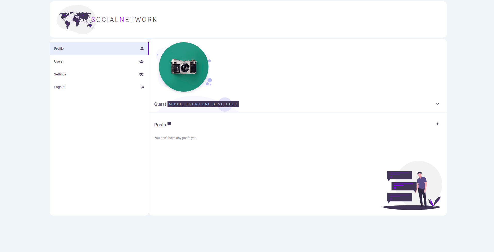
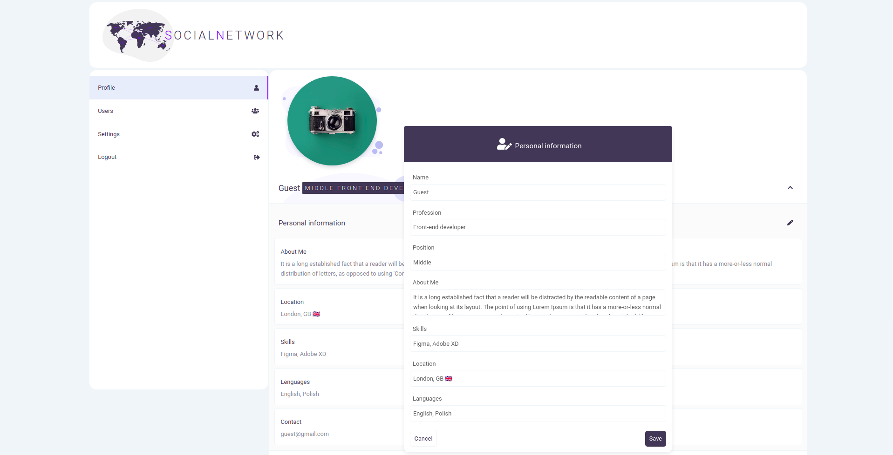

## Social network

> Full-stack application.

## Description

>  Full-stack application created by the MERN stack. The project is designed to demonstrate practical knowledge and skills about the React framework, application style with the SASS preprocessor, static typing with the Type Script, http requests with the Axios library and the CRUD RESTAPI.

### Demo

  https://social-network-demo-app.herokuapp.com

#### Screenshots of the app

 

  

### Technologies

#### Front-end

- [React](https://reactjs.org/) | A JavaScript library for building user interfaces.

- [Redux](https://redux.js.org/) | A Predictable State Container for JS Apps.

- [Formik](https://formik.org/) | Formik library for building forms in React.

- [SASS](https://sass-lang.com/) | Powerful CSS pre-processor.

- [TypeScript](https://www.typescriptlang.org/) | TypeScript is a typed superset of JavaScript that compiles to plain JavaScript..

#### Back-end

- [Nodejs](https://nodejs.org/en/) | Node.js® is a JavaScript runtime built on Chrome's V8 JavaScript engine..

- [Express](http://expressjs.com/) | Fast, unopinionated, minimalist web framework for Node.js.

- [MongoDB](https://www.mongodb.com/) | NoSQL database.

- [JWT](https://jwt.io/) | JSON Web Tokens are an open, industry standard RFC 7519 method for representing claims securely between two parties..

## Getting started

  App requires to have node (4.x.x) and npm (2.x.x) installed.

#### Start with installing the dependencies:

  Run `npm install` to install all required packages.

#### Replacing Mongo URL

  Replace MONGO_URL value in `config/config.env` file with your database url or with local one.

#### Running:

  Use `npm run dev` to start the dev server.

